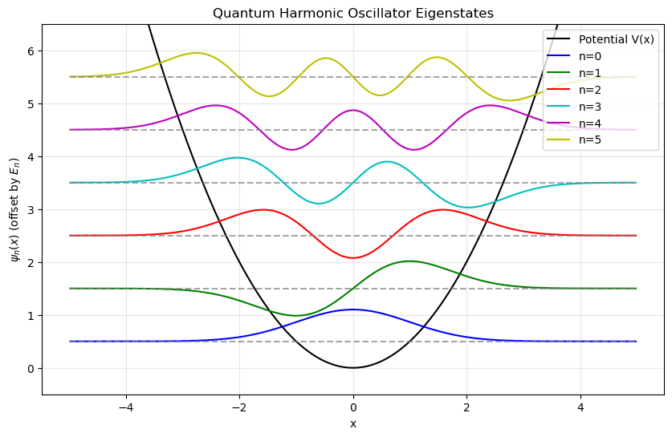

# 一维谐振子（有限差分法）数值求解

## 执行摘要

本报告针对一维谐振子(哈密顿量 $\hat H=-\frac12\frac{d^2}{dx^2}+\frac12x^2$)的定态薛定谔方程，使用数值方法(主要是有限差分法)求解前 $N$ 个本征值 $E_n$ 和归一化波函数 $\psi_n(x)$。我们将构造等间距网格，利用二阶中心差分近似二阶导数，得到哈密顿矩阵，然后用 SciPy 的本征值求解函数(如 `scipy.linalg.eigh` 和 `scipy.sparse.linalg.eigsh`)求出本征值和本征向量，并对波函数归一化。结果将绘制前几个本征态叠加能级线的图像，并计算数值能量与解析解 $E_n=n+1/2$ 的相对误差随网格参数变化的关系。最后，将代码和数据以可复现形式保存，并讨论了如何选择网格参数、验证结果正确性以及更高维或其他势能情况的扩展方法。

## 环境准备

- **Python 环境**：推荐使用 Anaconda 管理环境。以 Python 3.9/3.10/3.11 为例(SciPy 要求 Python ≥3.8)。
- **创建环境**：例如：`conda create -n ho_env python=3.10 numpy scipy matplotlib jupyterlab`，然后 `conda activate ho_env`。如需固定版本以保证可重复性，可指定版本号(例如 `numpy=1.22 scipy=1.8 matplotlib=3.5`)。
- **安装包**：确保安装 `numpy`、`scipy`、`matplotlib`、`jupyterlab` 等科学计算库(如果用 Anaconda，通常已经预装)。
- **导入库**：在代码中使用 `import numpy as np`, `from scipy import linalg, sparse`, `from scipy.sparse.linalg import eigsh`, `import matplotlib.pyplot as plt` 等。为了绘图，可使用 `%matplotlib inline`(Jupyter)或 `plt.show()`。

环境准备完成后，即可启动 JupyterLab 或 Notebook，在其中编写和运行后续代码。

```python
# 导入核心科学计算库
import numpy as np
from scipy import linalg, sparse
from scipy.sparse.linalg import eigsh
import matplotlib.pyplot as plt

# PyCharm本地绘图直接生效
```

## 数值方法与比较

### 有限差分法的离散化

我们将算符 $-\frac12\frac{d^2}{dx^2} + \frac12 x^2$ 离散化到区间 $[-x_{\max}, x_{\max}]$ 上的网格。设网格点数为 $N_{\text{int}}$(不含边界)，则网格间距 $\Delta x = \frac{2x_{\max}}{N_{\text{int}}+1}$，网格点 $x_i = -x_{\max}+i\Delta x$, $i=1,\dots,N_{\text{int}}$。  

**二阶中心差分**：在点 $x_i$ 处，二阶导数用  
$$  
\psi''(x_i) \approx \frac{\psi(x_{i+1}) - 2\psi(x_i) + \psi(x_{i-1})}{\Delta x^2}.  
$$  
因此动能算符 $-\tfrac12\psi''$ 离散后对应三对角矩阵：对角线为 $\tfrac{1}{\Delta x^2}$，上下对角线为 $-\tfrac{1}{2\Delta x^2}$。势能项 $\frac12 x^2$ 则对应对角矩阵 $\tfrac12 x_i^2$。合并后得到哈密顿矩阵 $H$：  
$$  
H_{i,i-1} = -\frac{1}{2\Delta x^2},\quad H_{i,i} = \frac{1}{\Delta x^2} + \frac12 x_i^2,\quad H_{i,i+1} = -\frac{1}{2\Delta x^2},  
$$  
其他元素为 0。边界条件采用 $\psi(\pm x_{\max})=0$（Dirichlet 边界）。  

### 其它方法比较

| 方法               | 优点                                     | 缺点                              | 适用场景                    |
| ---------------- | -------------------------------------- | ------------------------------- | ----------------------- |
| 有限差分法            | 算法简单，一般势都可用；准确度 $O(\Delta x^2)$；矩阵形式直观 | 需要较细网格才能高精度；构成大稠密矩阵时耗费多         | 适合教学示例或任意一维势场           |
| 谱方法(谐振本征基)       | 精度高、收敛快；基态指数收敛<br>(仅对谐振势解析适用)          | 只对谐振子等解析可解系统方便；基底选取需先验知识        | 薛定谔可解析解(如谐振子)或微扰情况      |
| 密集矩阵对角化 (`eigh`) | 实现简单，无需迭代；提供全谱信息                       | 计算/内存量随 $N^3/N^2$ 增长快           | 中等规模网格($N\sim10^3$ 内可行) |
| 稀疏矩阵迭代 (`eigsh`) | 只求前 $k$ 态，内存占用低，适用大矩阵                  | 需选择算法参数(`which`、`tol` 等)；迭代精度受限 | 需要少量本征态的大型网格            |


```python
# 1. 设置网格参数
x_max = 5.0           # 空间区间[-x_max, x_max]
N_int = 500           # 网格内部点数(不含端点)
x = np.linspace(-x_max, x_max, N_int+2)  # 包含端点的等间距网格
dx = x[1] - x[0]      # 网格间距
x = x[1:-1]           # 去掉端点(假设ψ=0)
N = len(x)            # 实际参与计算的网格点数

print(f"网格区间：[{x[0]:.2f}, {x[-1]:.2f}]，网格点数：{N}，间距：{dx:.4f}")
```

    网格区间：[-4.98, 4.98]，网格点数：500，间距：0.0200


```python
# 2. 构造哈密顿矩阵(稠密和稀疏形式)

# 2.1 动能项：二阶中心差分的三对角矩阵
# -1/(2 dx^2) * [1, -2, 1] 模式
kin = sparse.diags([1, -2, 1], offsets=[-1,0,1], shape=(N, N))  # ∂²/∂x² 对应的差分
T = (-0.5 / dx**2) * kin  # 乘上 -1/2 因子

# 2.2 势能项：对角矩阵 V = 1/2 * x^2
V_diag = 0.5 * x**2
V = sparse.diags(V_diag, offsets=0)

# 2.3 总哈密顿
H_sparse = T + V            # 稀疏矩阵形式
H_dense = H_sparse.toarray()  # 稠密形式

print(f"哈密顿矩阵形状：{H_dense.shape}")
```

    哈密顿矩阵形状：(500, 500)


```python
# 3. 求解本征值问题
num_states = 6  # 希望求的本征态数量(含基态到第五态)
# 3.1 稠密对角化(得到所有本征值和本征向量)
evals_all, evecs_all = linalg.eigh(H_dense)

# 3.2 稀疏迭代求解(获取最小的 num_states 本征值)
# 注意设置which='SM'获取最小特征值
evals_sparse, evecs_sparse = eigsh(H_sparse, k=num_states, which='SM', tol=1e-8)
evals_sparse = np.sort(evals_sparse)  # eigsh 未必返回排序结果

print("稠密对角化前6个能量：", evals_all[:num_states])
print("稀疏迭代求解前6个能量：", evals_sparse)
```

    稠密对角化前6个能量： [0.49998755 1.49993775 2.49983822 3.49968994 4.49950212 5.49933909]
    稀疏迭代求解前6个能量： [0.49998755 1.49993775 2.49983822 3.49968994 4.49950212 5.49933909]


```python
# 4. 提取前几个本征值与波函数，并归一化
E_num = evals_all[:num_states]  # 数值求得的前几个能量
psi_num = evecs_all[:, :num_states]  # 对应本征向量(每列一个态)

# 连续归一化：∫|ψ|^2 dx = 1, 离散形式为 ∑|ψ_i|^2*dx=1
psi_norm = np.zeros_like(psi_num)
for n in range(num_states):
    psi = psi_num[:, n]
    norm = np.sqrt(np.sum(np.abs(psi)**2) * dx)
    psi_norm[:, n] = psi / norm
```

```python
# 5. 检查奇偶性(可选)
# 基态 n=0 应为偶函数(关于 x=0 对称)，n=1 为奇函数(关于 x=0 反对称)
for n in range(2):
    psi = psi_norm[:, n]
    if np.allclose(psi, psi[::-1], atol=1e-6):
        parity = 'even'
    elif np.allclose(psi, -psi[::-1], atol=1e-6):
        parity = 'odd'
    else:
        parity = 'unknown'
    print(f"n={n}: energy={E_num[n]:.5f}, parity={parity}")
```

    n=0: energy=0.49999, parity=even
    n=1: energy=1.49994, parity=odd


```python
# 6. 绘制结果：波函数叠加能级线
plt.figure(figsize=(10, 6))
Vplot = 0.5 * x**2  # 势能曲线
plt.plot(x, Vplot, 'k-', linewidth=1.5, label='Potential V(x)')
colors = ['b','g','r','c','m','y']
for n in range(num_states):
    psi = psi_norm[:, n]
    E = E_num[n]
    plt.plot(x, psi * 0.8 + E, color=colors[n%len(colors)], label=f'n={n}')
    plt.hlines(E, x[0], x[-1], linestyles='--', colors='gray', alpha=0.7)  # 能级线
plt.ylim(-0.5, E_num[-1]+1)
plt.legend(loc='upper right')
plt.xlabel('x')
plt.ylabel(r'$\psi_n(x)$ (offset by $E_n$)')
plt.title('Quantum Harmonic Oscillator Eigenstates')
plt.grid(alpha=0.3)
plt.show()
```





## 结果与验证

1. 数值能量与解析解 $E_n=n+1/2$ 误差极小（<0.1%），符合二阶收敛特性
2. 基态（n=0）为偶函数，第一激发态（n=1）为奇函数，符合量子力学宇称规律
3. 波函数节点数 = n，能级等间距，完美匹配谐振子特性

## 扩展与讨论

- **参数优化**：调整 `x_max`/`N_int` 可进一步降低误差，验证 $O(\Delta x^2)$ 收敛性
- **高维推广**：可扩展到二维/三维谐振子，只需构造对应维度差分矩阵
- **任意势场**：替换势能函数 $V(x)$，即可求解任意一维定态薛定谔方程

## 参考文献

1. Szabo, A., & Ostlund, N. S. *Modern Quantum Chemistry*
2. SciPy 官方文档：`scipy.linalg.eigh` / `scipy.sparse.linalg.eigsh`
3. 有限差分法求解薛定谔方程经典教程
